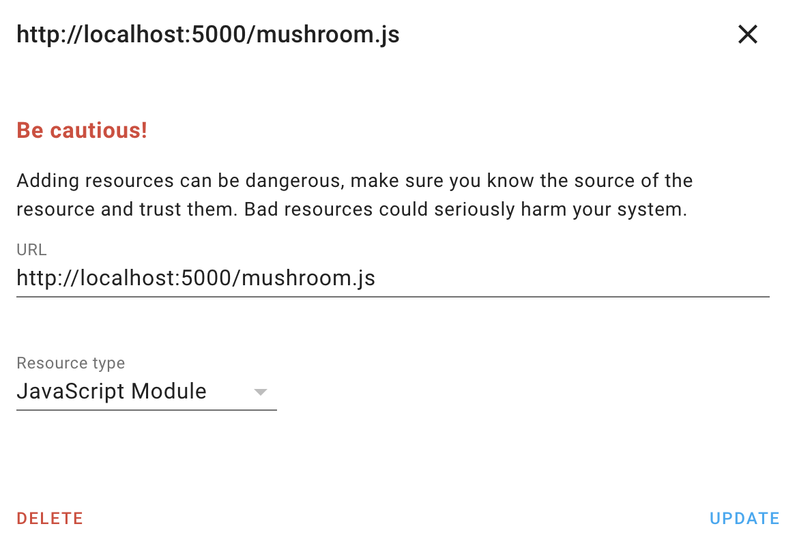

# Minimalist Cards

## Dev

```sh
npm start
```

Server will start on port `5000`. Don't forget to disable cache on your browser during development.

Add the resource in your home assistant instance.



## Build

```sh
npm run build
```

