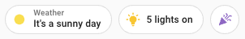
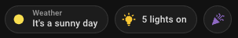

# Template badge

## Description

A template badge allows you to build a custom badge. You can use `entity` as a variable for the entity set on the badge e.g. `{{ states(entity) }}`.

> [!WARNING]  
> Home Assistant **2024.8** is required to use custom badges.

## Configuration variables

All the options are available in the lovelace editor but you can use `yaml` if you want.

| Name                | Type            | Default  | Description                                                                                                                                     |
| :------------------ | :-------------- | :------- | :---------------------------------------------------------------------------------------------------------------------------------------------- |
| `entity`            | string          | Optional | Entity for template and actions                                                                                                                 |
| `icon`              | string          | Optional | Icon to render. May contain [templates](https://www.home-assistant.io/docs/configuration/templating/) \*.                                       |
| `color`             | string          | Optional | Color to render. May contain [templates](https://www.home-assistant.io/docs/configuration/templating/).                                         |
| `label`             | string          | Optional | Label to render. Only displayed if content is not empty. May contain [templates](https://www.home-assistant.io/docs/configuration/templating/). |
| `content`           | string          | Optional | Content to render. May contain [templates](https://www.home-assistant.io/docs/configuration/templating/).                                       |
| `picture`           | string          | Optional | Picture to render. May contain [templates](https://www.home-assistant.io/docs/configuration/templating/).                                       |
| `tap_action`        | action          | `none`   | Home assistant action to perform on tap                                                                                                         |
| `hold_action`       | action          | `none`   | Home assistant action to perform on hold                                                                                                        |
| `double_tap_action` | action          | `none`   | Home assistant action to perform on double_tap                                                                                                  |
| `entity_id`         | `string` `list` | Optional | Only reacts to the state changes of these entities. This can be used if the automatic analysis fails to find all relevant entities.             |

#### Notes

\* You can render weather svg icons using [weather state](https://developers.home-assistant.io/docs/core/entity/weather/#recommended-values-for-state-and-condition) as icon :

- weather-clear-night
- weather-cloudy
- weather-fog
- weather-lightning
- weather-lightning-rainy
- weather-partlycloudy
- weather-pouring
- weather-rainy
- weather-hail
- weather-snowy
- weather-snowy-rainy
- weather-sunny
- weather-windy
- weather-windy-variant
