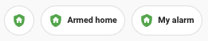
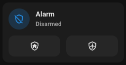

# Alarm control panel card




## Description

An alarm control panel card allows you to control a alarm panel entity.

## Configuration variables

All the options are available in the lovelace editor but you can use `yaml` if you want.

| Name                | Type                                                | Default                        | Description                                                                         |
| :------------------ | :-------------------------------------------------- | :----------------------------- | :---------------------------------------------------------------------------------- |
| `entity`            | string                                              | Required                       | Alarm control panel entity                                                          |
| `icon`              | string                                              | Optional                       | Custom icon                                                                         |
| `name`              | string                                              | Optional                       | Custom name                                                                         |
| `layout`            | string                                              | Optional                       | Layout of the card. Vertical, horizontal and default layout are supported           |
| `fill_container`    | boolean                                             | `false`                        | Fill container or not. Useful when card is in a grid, vertical or horizontal layout |
| `primary_info`      | `name` `state` `last-changed` `last-updated` `none` | `name`                         | Info to show as primary info                                                        |
| `secondary_info`    | `name` `state` `last-changed` `last-updated` `none` | `state`                        | Info to show as secondary info                                                      |
| `icon_type`         | `icon` `entity-picture` `none`                      | `icon`                         | Type of icon to display                                                             |
| `states`            | list                                                | `["armed_home", "armed_away"]` | List of arm states to display. See [Custom mode icons](#custom-mode-icons)          |
| `tap_action`        | action                                              | `more-info`                    | Home assistant action to perform on tap                                             |
| `hold_action`       | action                                              | `more-info`                    | Home assistant action to perform on hold                                            |
| `double_tap_action` | action                                              | `more-info`                    | Home assistant action to perform on double_tap                                      |

## Custom mode icons

Each entry of `states` is either a plain arm state...

```yaml
type: custom:mushroom-alarm-control-panel-card
entity: alarm_control_panel.alarm
states:
  - armed_home
  - armed_away
```

...or an object with a `state` and an optional `icon`, to override the icon of that arm button:

```yaml
type: custom:mushroom-alarm-control-panel-card
entity: alarm_control_panel.alarm
states:
  - state: armed_home
    icon: mdi:sofa
  - state: armed_night
    icon: mdi:sleep
  - armed_away # keeps the default icon
```

| Name    | Type   | Default  | Description                                                |
| :------ | :----- | :------- | :--------------------------------------------------------- |
| `state` | string | Required | Arm state, e.g. `armed_home`                               |
| `icon`  | string | Optional | Custom icon for this arm button. Defaults to the mode icon |

Both forms can be mixed in the same list. Omitting `icon` is identical to using the
plain string form.

> The visual editor has no per-mode icon picker yet, so icons must be set through YAML.
> Selecting states in the visual editor preserves any icons already configured in YAML.
> The disarm button icon is not customizable.
