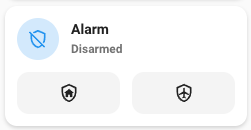

# Alarm control panel card

## Description

An alarm control panel card allows you to control a alarm panel entity.

## Configuration variables

All the options are available in the lovelace editor but you can use `yaml` if you want.

| Name                | Type                                                | Default                        | Description                                                                         |
| :------------------ | :-------------------------------------------------- | :----------------------------- | :---------------------------------------------------------------------------------- |
| `entity`            | string                                              | Required                       | Alarm control panel entity                                                          |
| `icon`              | string                                              | Optional                       | Custom icon                                                                         |
| `name`              | string                                              | Optional                       | Custom name                                                                         |
| `layout`            | string                                              | Optional                       | Layout of the card. Vertical, horizontal and default layout are supported           |
| `fill_container`    | boolean                                             | `false`                        | Fill container or not. Useful when card is in a grid, vertical or horizontal layout |
| `primary_info`      | `name` `state` `last-changed` `last-updated` `none` | `name`                         | Info to show as primary info                                                        |
| `secondary_info`    | `name` `state` `last-changed` `last-updated` `none` | `state`                        | Info to show as secondary info                                                      |
| `icon_type`         | `icon` `entity-picture` `none`                      | `icon`                         | Type of icon to display                                                             |
| `states`            | list                                                | `["armed_home", "armed_away"]` | List of arm states to display                                                       |
| `tap_action`        | action                                              | `more-info`                    | Home assistant action to perform on tap                                             |
| `hold_action`       | action                                              | `more-info`                    | Home assistant action to perform on hold                                            |
| `double_tap_action` | action                                              | `more-info`                    | Home assistant action to perform on double_tap                                      |
