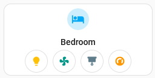
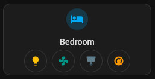

# Area card

## Description

An area card allows you to interact with lights and entities tied to a specific area(room).

## Configuration variables

All the options are available in the lovelace editor but you can use `yaml` if you want.

| Name                | Type                  | Default  | Description                                                               |
| :------------------ | :-------------------- | :------- | :------------------------------------------------------------------------ |
| `area`              | string                | Required | Area/Room                                                                 |
| `icon`              | string                | Optional | Custom icon                                                               |
| `name`              | string                | Optional | Custom name                                                               |
| `layout`            | string                | Optional | Layout of the card. Vertical, horizontal and default layout are supported |
| `tap_action`        | action                | `none`   | Home assistant action to perform on tap                                   |
| `hold_action`       | action                | `none`   | Home assistant action to perform on hold                                  |
| `double_tap_action` | action                | `none`   | Home assistant action to perform on double_tap                            |
| `chips`             | [`chip`](#chip) array | Optional | Array of chips to display                                                 |

### Chip

| Name                 | Type    | Default     | Description                                                               |
| :------------------- | :------ | :---------- | :------------------------------------------------------------------------ |
| `type`               | string  | Required    | `entity` or `light`                                                       |
| `entity`             | string  | Optional    | Entity or light domain records depending on type                          |
| `name`               | string  | Optional    | Custom name                                                               |
| `content_info`       | string  | `state`     | Layout of the card. Vertical, horizontal and default layout are supported |
| `use_entity_picture` | boolean | Optional    | Custom icon                                                               |
| `tap_action`         | action  | `more-info` | Home assistant action to perform on tap                                   |
| `hold_action`        | action  | `more-info` | Home assistant action to perform on hold                                  |
| `double_tap_action`  | action  | `more-info` | Home assistant action to perform on double_tap                            |
