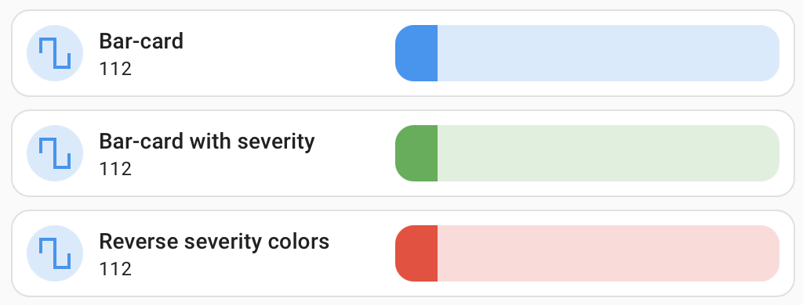

# Number

## Description

A bar card allows you to display state of numeric sensors, number, input_number and air_condition entities.

## Configuration variables

All the options are available in the lovelace editor but you can use `yaml` if you want.

| Name                    | Type                                                        | Default                                    | Description                                                                         |
| :---------------------- | :---------------------------------------------------------- | :----------------------------------------- | :---------------------------------------------------------------------------------- |
| `entity`                | string                                                      | Required                                   | Number or input_number Entity                                                       |
| `icon`                  | string                                                      | Optional                                   | Custom icon                                                                         |
| `icon_color`            | string                                                      | `blue`                                     | Custom color for icon when entity state is active                                   |
| `name`                  | string                                                      | Optional                                   | Custom name                                                                         |
| `layout`                | string                                                      | Optional                                   | Layout of the card. Vertical, horizontal and default layout are supported           |
| `fill_container`        | boolean                                                     | `false`                                    | Fill container or not. Useful when card is in a grid, vertical or horizontal layout |
| `primary_info`          | `name` `state` `last-changed` `last-updated` `none`         | `name`                                     | Info to show as primary info                                                        |
| `secondary_info`        | `name` `state` `last-changed` `last-updated` `none`         | `state`                                    | Info to show as secondary info                                                      |
| `icon_type`             | `icon` `entity-picture` `none`                              | `icon`                                     | Type of icon to display                                                             |
| `min`                   | `number`                                                    | `0` or `min` from entity attrs if exists   | Min value on the bar                                                                |
| `max`                   | `number`                                                    | `100` or `max` from entity attrs if exists | Max value on the bar                                                                |   
| `enable_color_severity` | boolean                                                     | false                                      | Enables color changing depending entity value.                                      |
| `severity_direction`    | `forward`(from green to red) `reverse`(from red to green)   | `forward`                                  | Change color palette order.                                                         |
| `tap_action`            | action                                                      | `more-info`                                | Home assistant action to perform on tap                                             |
| `hold_action`           | action                                                      | `more-info`                                | Home assistant action to perform on hold                                            |
| `double_tap_action`     | action                                                      | `more-info`                                | Home assistant action to perform on double_tap                                      |
