# Chips card

## Description

A chips card allows you to put small information at the top of your dashboard

## Configuration variables

All the options are available in the lovelace editor but you can use `yaml` if you want.

| Name        | Type       | Default  | Description                                                                          |
| :---------- | :--------- | :------- | :----------------------------------------------------------------------------------- |
| `alignment` | string     | Optional | Chips alignment (`end`, `center`, `justify`), when empty default behavior is `start` |
| `chips`     | chip array | Optional | Custom icon                                                                          |

### Action chip

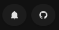

An action chip allows you to perform a Home Assistant action (navigate, perform-action, etc...).

### Alarm control panel chip

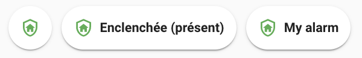
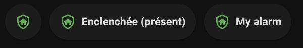

An alarm control panel is an entity chip that allows you to display the right icon and with the right color for alarm control panels.

### Back chip

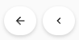

A back chip allows you to perform a back action.

### Conditional chip

A conditional chip allows you to display another chip based on chip state.

### Entity chip

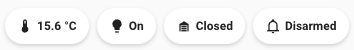
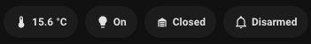

An entity chip allows you to display entity state.

### Light chip

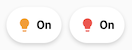
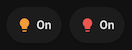

An light chip allows you to display light.

### Menu chip

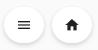
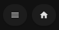

A menu chip allows you to open the drawer in mobile.

### Spacer chip

A spacer chip allows you to space chips apart.

### Template chip

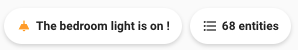
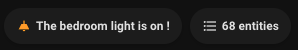

A template chip allows you to build custom chip using [templates](https://www.home-assistant.io/docs/configuration/templating/) \*.

### Weather chip

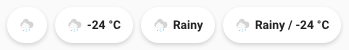
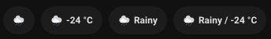

A weather chip allows you to display the weather.

#### Notes

\* You can render weather svg icons using [weather state](https://developers.home-assistant.io/docs/core/entity/weather/#recommended-values-for-state-and-condition) as icon :

- weather-clear-night
- weather-cloudy
- weather-fog
- weather-lightning
- weather-lightning-rainy
- weather-partlycloudy
- weather-pouring
- weather-rainy
- weather-hail
- weather-snowy
- weather-snowy-rainy
- weather-sunny
- weather-windy
- weather-windy-variant
