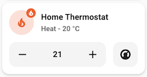
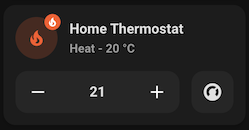

# Climate card

## Description

A climate card allows you to control a climate entity.

## Configuration variables

All the options are available in the lovelace editor but you can use `yaml` if you want.

| Name                       | Type                                                | Default     | Description                                                                                     |
| :------------------------- | :-------------------------------------------------- | :---------- | :---------------------------------------------------------------------------------------------- |
| `entity`                   | string                                              | Required    | Climate entity                                                                                  |
| `icon`                     | string                                              | Optional    | Custom icon                                                                                     |
| `name`                     | string                                              | Optional    | Custom name                                                                                     |
| `layout`                   | string                                              | Optional    | Layout of the card. Vertical, horizontal and default layout are supported                       |
| `fill_container`           | boolean                                             | `false`     | Fill container or not. Useful when card is in a grid, vertical or horizontal layout             |
| `primary_info`             | `name` `state` `last-changed` `last-updated` `none` | `name`      | Info to show as primary info                                                                    |
| `secondary_info`           | `name` `state` `last-changed` `last-updated` `none` | `state`     | Info to show as secondary info                                                                  |
| `icon_type`                | `icon` `entity-picture` `none`                      | `icon`      | Type of icon to display                                                                         |
| `hvac_modes`               | list                                                | `[]`        | List of hvac modes to display (auto, heat_cool, heat, cool, dry, fan_only, off)                 |
| `show_temperature_control` | boolean                                             | `false`     | Show buttons to control target temperature                                                      |
| `collapsible_controls`     | boolean                                             | `false`     | Collapse controls when off. When used in section, it can produce a layout shift for cards below |
| `tap_action`               | action                                              | `more-info` | Home assistant action to perform on tap                                                         |
| `hold_action`              | action                                              | `more-info` | Home assistant action to perform on hold                                                        |
| `double_tap_action`        | action                                              | `more-info` | Home assistant action to perform on double_tap                                                  |
