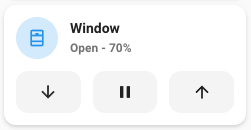
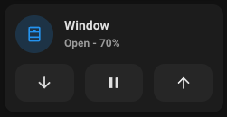

# Cover card




## Description

A cover card allows you to control a cover entity.

## Configuration variables

All the options are available in the lovelace editor but you can use `yaml` if you want.

| Name                         | Type                                                         | Default     | Description                                                                         |
| :--------------------------- | :----------------------------------------------------------- | :---------- | :---------------------------------------------------------------------------------- |
| `entity`                     | string                                                       | Required    | Cover entity                                                                        |
| `icon`                       | string                                                       | Optional    | Custom icon                                                                         |
| `name`                       | string                                                       | Optional    | Custom name                                                                         |
| `layout`                     | string                                                       | Optional    | Layout of the card. Vertical, horizontal and default layout are supported           |
| `fill_container`             | boolean                                                      | `false`     | Fill container or not. Useful when card is in a grid, vertical or horizontal layout |
| `primary_info`               | `name` `state` `last-changed` `last-updated` `none`          | `name`      | Info to show as primary info                                                        |
| `secondary_info`             | `name` `state` `last-changed` `last-updated` `none`          | `state`     | Info to show as secondary info                                                      |
| `icon_type`                  | `icon` `entity-picture` `none`                               | `icon`      | Type of icon to display                                                             |
| `show_buttons_control`       | boolean                                                      | `false`     | Show buttons to open, close and stop cover                                          |
| `show_position_control`      | boolean                                                      | `false`     | Show a slider to control position of the cover                                      |
| `show_tilt_position_control` | boolean                                                      | `false`     | Show a slider to control tilt position of the cover                                 |
| `default_control`            | `buttons_control` `position_control` `tilt_position_control` | Optional    | Control displayed when the card is loaded                                           |
| `tap_action`                 | action                                                       | `toggle`    | Home assistant action to perform on tap                                             |
| `hold_action`                | action                                                       | `more-info` | Home assistant action to perform on hold                                            |
| `double_tap_action`          | action                                                       | `more-info` | Home assistant action to perform on double_tap                                      |

## Default control

When several controls are enabled, the card displays the first one of this list and lets you switch between them with the button on the right :

1. `buttons_control`
2. `position_control`
3. `tilt_position_control`

`default_control` overrides which control is displayed when the card is loaded. It only changes the initially displayed control, not the order used by the switch button. If the requested control is not enabled, the first enabled one is displayed instead.

```yaml
type: custom:mushroom-cover-card
entity: cover.blinds
show_buttons_control: true
show_position_control: true
show_tilt_position_control: true
default_control: tilt_position_control
```
