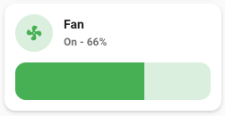
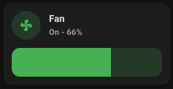

# Light card

## Description

A fan card allow you to control a fan entity.

## Configuration variables

All the options are available in the lovelace editor but you can use `yaml` if you want.

| Name                      | Type    | Default     | Description                              |
| :------------------------ | :------ | :---------- | :--------------------------------------- |
| `entity`                  | string  | Required    | Fan entity                               |
| `icon`                    | string  | Optional    | Custom icon                              |
| `name`                    | string  | Optional    | Custom name                              |
| `vertical`                | boolean | `false`     | Vertical layout                          |
| `hide_state`              | boolean | `false`     | Hide the entity state                    |
| `icon_animation`          | boolean | `false`     | Animate the icon when fan is `on`        |
| `show_percentage_control` | boolean | `false`     | Show a slider to control speed           |
| `show_oscillate_control`  | boolean | `false`     | Show a button to control oscillation     |
| `tap_action`              | action  | `toggle`    | Home assistant action to perform on tap  |
| `hold_action`             | action  | `more-icon` | Home assistant action to perform on hold |
