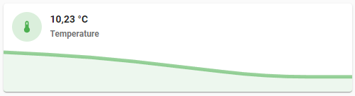
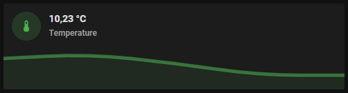

# Graph card

## Description

A graph card allow you to show the actual value and the history.

## Configuration variables

All the options are available in the lovelace editor but you can use `yaml` if you want.

| Name                | Type                                                | Default     | Description                                    |
| :------------------ | :-------------------------------------------------- | :---------- | :--------------------------------------------- |
| `entity`            | string                                              | Required    | Entity                                         |
| `name`              | string                                              | Optional    | Custom name                                    |
| `icon`              | string                                              | Optional    | Custom icon                                    |
| `hours_to_show`     | number                                              | Optional    | Number of hours to show in the history         |
| `graph_color`       | string                                              | Optional    | Entity chart and icon color                    |
| `primary_info`      | `name` `state` `last-changed` `last-updated` `none` | `name`      | Info to show as primary info                   |
| `secondary_info`    | `name` `state` `last-changed` `last-updated` `none` | `state`     | Info to show as secondary info                 |
| `graph_mode`        | string                                              | Optional    | Mode `line` or `fill`                          |
| `display_mode`      | string                                              | Optional    | Mode `standard` or `compact`                   |
| `tap_action`        | action                                              | `more-info` | Home assistant action to perform on tap        |
| `hold_action`       | action                                              | `more-info` | Home assistant action to perform on hold       |
| `double_tap_action` | action                                              | `more-info` | Home assistant action to perform on double_tap |
