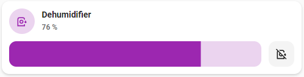
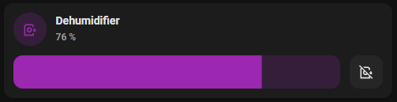

# Humidifier card

## Description

A humidifier card allow you to control a humidifier entity.

## Configuration variables

All the options are available in the lovelace editor but you can use `yaml` if you want.

| Name                           | Type    | Default     | Description                                                               |
| :----------------------------- | :------ | :---------- | :------------------------------------------------------------------------ |
| `entity`                       | string  | Required    | Humidifier entity                                                         |
| `icon`                         | string  | Optional    | Custom icon                                                               |
| `name`                         | string  | Optional    | Custom name                                                               |
| `icon_color`                   | string  | Optional    | Custom icon color                                                         |
| `show_target_humidity_control` | boolean | Optional    | Show target humidity control                                              |
| `show_buttons_control`         | boolean | Optional    | Show buttons control                                                      |
| `layout`                       | string  | Optional    | Layout of the card. Vertical, horizontal and default layout are supported |
| `hide_state`                   | boolean | `false`     | Hide the entity state                                                     |
| `tap_action`                   | action  | `more-info` | Home assistant action to perform on tap                                   |
| `hold_action`                  | action  | `more-info` | Home assistant action to perform on hold                                  |
| `double_tap_action`            | action  | `more-info` | Home assistant action to perform on double_tap                            |
