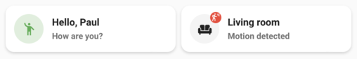

# Legacy template Card

> ⚠️ **Note**  
> This is the **legacy version** of the Template Card.  
> It is kept for backward compatibility but does not support all the features of the new [Template Card](./template.md).  
> **Use the new Template Card whenever possible.**

  


## Description


The **Legacy Template Card** allows you to build a customizable card while maintaining backward compatibility with older dashboards. It exists to ensure dashboards using **card-mod** or custom theming are not broken.  

You can use [templating](https://www.home-assistant.io/docs/configuration/templating/) in most fields.  
When defining an `entity`, you can reference it inside templates with the `entity` variable. For example:  

```yaml
primary: "{{ states(entity) }}"
````

---

## Configuration

All options are available in the **Lovelace editor**, but you can also configure the card directly in **YAML**.

| Name                  | Type          | Default  | Description                                                                                                   |
| :-------------------- | :------------ | :------- | :------------------------------------------------------------------------------------------------------------ |
| `entity`              | string        | Optional | Entity used for templating and actions.                                                                       |
| `icon`                | string        | Optional | Icon to display. Supports [templating](https://www.home-assistant.io/docs/configuration/templating/).         |
| `icon_color`          | string        | Optional | Color applied to the icon. Supports templating.                                                               |
| `primary`             | string        | Optional | Primary text (main label). Supports templating.                                                               |
| `secondary`           | string        | Optional | Secondary text (subtitle or status). Supports templating.                                                     |
| `badge_icon`          | string        | Optional | Icon displayed as a badge. Supports templating.                                                               |
| `badge_color`         | string        | Optional | Color applied to the badge icon. Supports templating.                                                         |
| `picture`             | string        | Optional | Image to display instead of an icon. Supports templating.                                                     |
| `multiline_secondary` | boolean       | `false`  | If `true`, secondary text can span multiple lines.                                                            |
| `layout`              | string        | Optional | Layout of the card. Supported values: `default`, `vertical`, or `horizontal`.                                 |
| `fill_container`      | boolean       | `false`  | If `true`, the card expands to fill its container. Useful in grids or when using vertical/horizontal layouts. |
| `tap_action`          | action        | `none`   | Action performed when the card is tapped.                                                                     |
| `hold_action`         | action        | `none`   | Action performed when the card is long-pressed.                                                               |
| `double_tap_action`   | action        | `none`   | Action performed when the card is double-tapped.                                                              |
| `entity_id`           | string / list | Optional | Restricts updates to these entities. Useful if automatic detection misses dependencies.                       |

---

## Notes

* Most fields support [templating](https://www.home-assistant.io/docs/configuration/templating/).
* You can render **weather SVG icons** by using the [standard weather entity states](https://developers.home-assistant.io/docs/core/entity/weather/#recommended-values-for-state-and-condition) as icon values:

  ```
  weather-clear-night
  weather-cloudy
  weather-fog
  weather-lightning
  weather-lightning-rainy
  weather-partlycloudy
  weather-pouring
  weather-rainy
  weather-hail
  weather-snowy
  weather-snowy-rainy
  weather-sunny
  weather-windy
  weather-windy-variant
  ```

---

## Example YAML

```yaml
type: custom:mushroom-legacy-template-card
entity: light.living_room
icon: mdi:lightbulb
icon_color: >
  
    yellow
  
    grey
  
primary: "{{ state_attr(entity, 'friendly_name') }}"
secondary: "Brightness: {{ state_attr(entity, 'brightness') | int }}"
tap_action:
  action: toggle
```

This configuration:

* Displays a light bulb icon that changes color depending on the state.
* Shows the entity’s friendly name as the primary text.
* Shows the brightness level as secondary text.
* Toggles the light when tapped.

```

---

⚡ Do you also want me to create a **“Differences between Template Card and Legacy Template Card”** section in markdown so users know when to use one vs the other?
```
