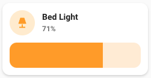
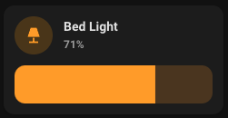

# Light card

## Description

A light card allow you to control a light entity.

## Configuration variables

All the options are available in the lovelace editor but you can use `yaml` if you want.

| Name                      | Type    | Default     | Description                                                               |
| :------------------------ | :------ | :---------- | :------------------------------------------------------------------------ |
| `entity`                  | string  | Required    | Light entity                                                              |
| `icon`                    | string  | Optional    | Custom icon                                                               |
| `name`                    | string  | Optional    | Custom name                                                               |
| `layout`                  | string  | Optional    | Layout of the card. Vertical, horizontal and default layout are supported |
| `hide_state`              | boolean | `false`     | Hide the entity state                                                     |
| `show_brightness_control` | boolean | `false`     | Show a slider to control brightness                                       |
| `show_color_temp_control` | boolean | `false`     | Show a slider to control temperature color                                |
| `show_color_control`      | boolean | `false`     | Show a slider to control RGB color                                        |
| `collapsible_controls`    | boolean | `false`     | Collapse controls when off                                                |
| `use_light_color`         | boolean | `false`     | Colorize the icon and slider according light temperature or color         |
| `tap_action`              | action  | `toggle`    | Home assistant action to perform on tap                                   |
| `hold_action`             | action  | `more-info` | Home assistant action to perform on hold                                  |
| `double_tap_action`       | action  | `more-info` | Home assistant action to perform on double_tap                            |
