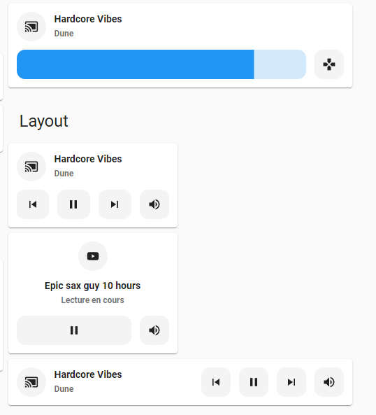
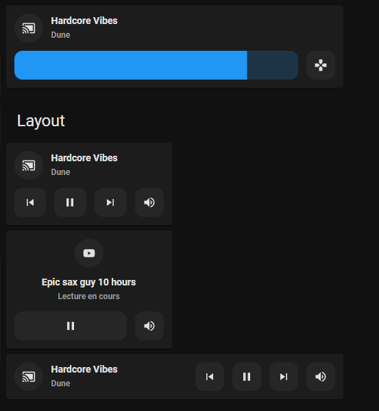

# Media Player card

## Description

A media player card allows you to control a media player entity.

## Configuration variables

All the options are available in the lovelace editor but you can use `yaml` if you want.

| Name                   | Type                                                | Default     | Description                                                                                     |
| :--------------------- | :-------------------------------------------------- | :---------- | :---------------------------------------------------------------------------------------------- |
| `entity`               | string                                              | Required    | Media Player entity                                                                             |
| `icon`                 | string                                              | Optional    | Custom icon                                                                                     |
| `name`                 | string                                              | Optional    | Custom name                                                                                     |
| `layout`               | string                                              | Optional    | Layout of the card. Vertical, horizontal and default layout are supported                       |
| `fill_container`       | boolean                                             | `false`     | Fill container or not. Useful when card is in a grid, vertical or horizontal layout             |
| `primary_info`         | `name` `state` `last-changed` `last-updated` `none` | `name`      | Info to show as primary info                                                                    |
| `secondary_info`       | `name` `state` `last-changed` `last-updated` `none` | `state`     | Info to show as secondary info                                                                  |
| `icon_type`            | `icon` `entity-picture` `none`                      | `icon`      | Type of icon to display                                                                         |
| `use_media_info`       | boolean                                             | `false`     | Use media info instead of name, state and icon when a media is playing                          |
| `show_volume_level`    | boolean                                             | `false`     | Show volume level next to media state when media is playing                                     |
| `media_controls`       | list                                                | `[]`        | List of controls to display (on_off, shuffle, previous, play_pause_stop, next, repeat)          |
| `volume_controls`      | list                                                | `[]`        | List of controls to display (volume_mute, volume_set, volume_buttons)                           |
| `collapsible_controls` | boolean                                             | `false`     | Collapse controls when off. When used in section, it can produce a layout shift for cards below |
| `tap_action`           | action                                              | `more-info` | Home assistant action to perform on tap                                                         |
| `hold_action`          | action                                              | `more-info` | Home assistant action to perform on hold                                                        |
| `double_tap_action`    | action                                              | `more-info` | Home assistant action to perform on double_tap                                                  |
