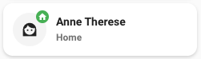
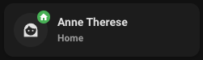

# Person card

## Description

A cover card allow you to control a person entity.

## Configuration variables

All the options are available in the lovelace editor but you can use `yaml` if you want.

| Name                 | Type    | Default     | Description                                          |
| :------------------- | :------ | :---------- | :--------------------------------------------------- |
| `entity`             | string  | Required    | Person entity                                        |
| `icon`               | string  | Optional    | Custom icon                                          |
| `name`               | string  | Optional    | Custom name                                          |
| `vertical`           | boolean | `false`     | Vertical layout                                      |
| `hide_state`         | boolean | `false`     | Hide the entity state                                |
| `hide_name`          | boolean | `false`     | Hide the person name                                 |
| `use_entity_picture` | boolean | `false`     | Use the picture of the person entity instead of icon |
| `tap_action`         | action  | `more-info` | Home assistant action to perform on tap              |
| `hold_action`        | action  | `more-info` | Home assistant action to perform on hold             |
| `double_tap_action`  | action  | `more-info` | Home assistant action to perform on double_tap       |
