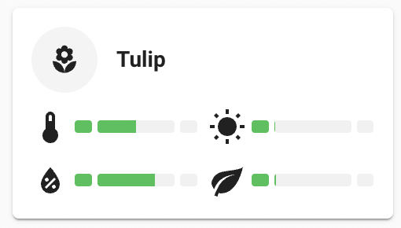
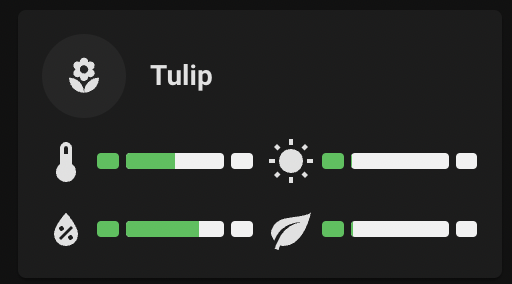

# Flower card




## Description

A flower card to display a plant entity. Also supports additional data from the [patched plant](https://github.com/Olen/homeassistant-plant) component.

## Configuration variables

All the options are available in the lovelace editor but you can use `yaml` if you want.

| Name                      | Type    | Default     | Description                                                               |
| :------------------------ | :------ | :---------- | :------------------------------------------------------------------------ |
| `entity`                  | string  | Required    | Plant entity                                                               |
| `icon`                    | string  | Optional    | Custom icon                                                               |
| `name`                    | string  | Optional    | Custom name                                                               |
| `use_entity_picture`      | boolean | Optional    | Use entity image                                                          |
| `min_temperature`         | number  | 3           | Minimum Temperature                                                       |
| `max_temperature`         | number  | 35          | Maximum Temperature                                                       |
| `min_moisture`            | number  | 20          | Minimum Moisture Percentage                                               |
| `max_moisture`            | number  | 60          | Maximum Moisture Percentage                                               |
| `min_conductivity`        | number  | 500         | Minimum Soil Conductivity                                                 |
| `max_conductivity`        | number  | 3000        | Maximum Soil Conductivity                                                 |
| `min_brightness`          | number  | 2500        | Minimum Brightness                                                        |
| `max_brightness`          | number  | 30000       | Maximum Brightness                                                        |
| `layout`                  | string  | Optional    | Layout of the card. Vertical, horizontal and default layout are supported |
| `hide_state`              | boolean | `false`     | Hide the entity state                                                     |
| `tap_action`              | action  | `toggle`    | Home assistant action to perform on tap                                   |
| `hold_action`             | action  | `more-info` | Home assistant action to perform on hold                                  |
| `double_tap_action`       | action  | `more-info` | Home assistant action to perform on double_tap                            |

### Entity Image

By default, the entity image will pull from Plantbook if you are using the [patched plant](https://github.com/Olen/homeassistant-plant) component.

If you are not using the patched component, and still wish to use an entity image, you will need to add this to the 
customize section of your `configuration.yaml`, as the `plant` integration does not support this by default

```yaml
homeassistant:
    customize:
      plant.tulip:
        entity_picture: "/local/mushrooms.jpeg"
```
