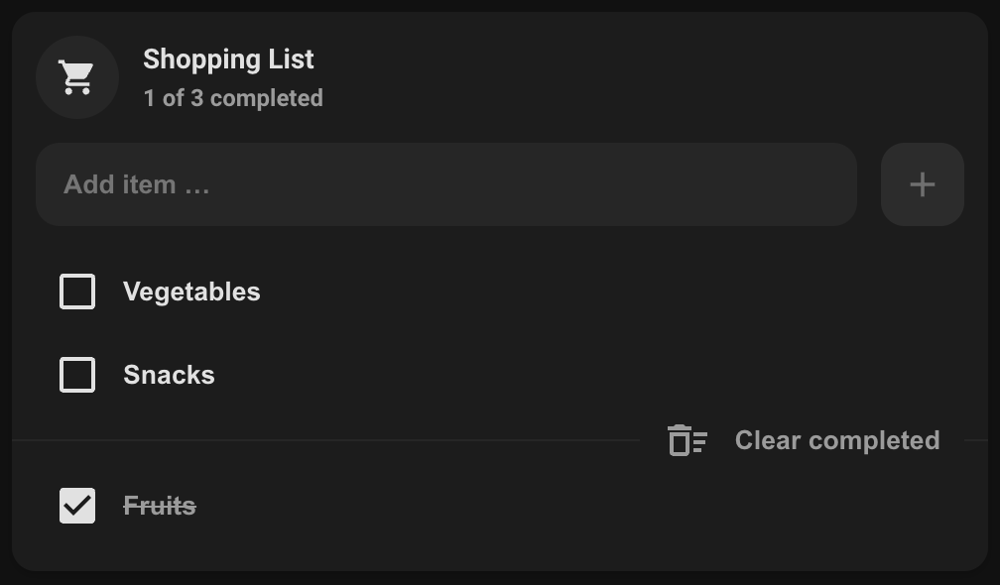

# Shopping list card

## Description

A mushroom card for the [shopping_list](https://www.home-assistant.io/integrations/shopping_list) integration.

## Configuration variables

All options are available in the lovelace editor but you can use `yaml` if you want.

| Name             | Type                              | Default                      | Description                                      |
| :--------------- | :-------------------------------- | :--------------------------- | :----------------------------------------------- |
| `name`           | string                            | Shopping List                | Name of the card. May be displayed as its title. |
| `icon`           | string                            | `mdi:cart`                   | Icon displayed next to the title.                |
| `layout`         | `default` `horizontal` `vertical` | `default`                    | Affects the internal layout of the card.         |
| `primary_info`   | `name` `state` `none`             | `name`                       | Info to show as title.                           |
| `secondary_info` | `name` `state` `none`             | `state`                      | Info to show as subtitle.                        |
| `checked_icon`   | string                            | `mdi:checkbox-marked`        | Icon used for completed items.                   |
| `unchecked_icon` | string                            | `mdi:checkbox-blank-outline` | Icon used for open items.                        |
