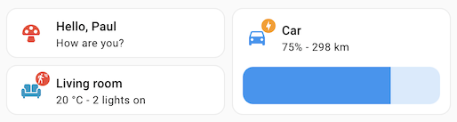
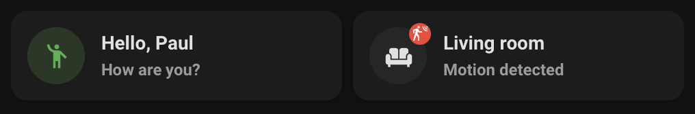

# Template card

## Description

A template card allows you to build a custom card. You can use `entity` as a variable for the entity set on the card e.g. `{{ states(entity) }}`.

## Configuration variables

All the options are available in the lovelace editor but you can use `yaml` if you want.

| Name                  | Type            | Default  | Description                                                                                                                         |
| :-------------------- | :-------------- | :------- | :---------------------------------------------------------------------------------------------------------------------------------- |
| `entity`              | string          | Optional | Entity for template and actions                                                                                                     |
| `icon`                | string          | Optional | Icon to render. May contain [templates](https://www.home-assistant.io/docs/configuration/templating/) \*.                           |
| `icon_color`          | string          | Optional | Icon color to render. May contain [templates](https://www.home-assistant.io/docs/configuration/templating/).                        |
| `primary`             | string          | Optional | Primary info to render. May contain [templates](https://www.home-assistant.io/docs/configuration/templating/).                      |
| `secondary`           | string          | Optional | Secondary info to render. May contain [templates](https://www.home-assistant.io/docs/configuration/templating/).                    |
| `badge_icon`          | string          | Optional | Badge icon to render. May contain [templates](https://www.home-assistant.io/docs/configuration/templating/).                        |
| `badge_color`         | string          | Optional | Badge icon color to render. May contain [templates](https://www.home-assistant.io/docs/configuration/templating/).                  |
| `picture`             | string          | Optional | Picture to render. May contain [templates](https://www.home-assistant.io/docs/configuration/templating/).                           |
| `multiline_secondary` | boolean         | `false`  | Enables support for multiline text for the secondary info.                                                                          |
| `layout`              | string          | Optional | Layout of the card. Vertical, horizontal and default layout are supported                                                           |
| `fill_container`      | boolean         | `false`  | Fill container or not. Useful when card is in a grid, vertical or horizontal layout                                                 |
| `tap_action`          | action          | `none`   | Home assistant action to perform on tap                                                                                             |
| `hold_action`         | action          | `none`   | Home assistant action to perform on hold                                                                                            |
| `double_tap_action`   | action          | `none`   | Home assistant action to perform on double_tap                                                                                      |
| `entity_id`           | `string` `list` | Optional | Only reacts to the state changes of these entities. This can be used if the automatic analysis fails to find all relevant entities. |

#### Notes

\* You can render weather svg icons using [weather state](https://developers.home-assistant.io/docs/core/entity/weather/#recommended-values-for-state-and-condition) as icon :

- weather-clear-night
- weather-cloudy
- weather-fog
- weather-lightning
- weather-lightning-rainy
- weather-partlycloudy
- weather-pouring
- weather-rainy
- weather-hail
- weather-snowy
- weather-snowy-rainy
- weather-sunny
- weather-windy
- weather-windy-variant
