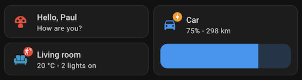

# Template Card

  


## Description

The **Template Card** allows you to build fully customizable cards for your dashboard.  
You can use [templating](https://www.home-assistant.io/docs/configuration/templating/) in most fields.

When defining an `entity` or an `area`, you can reference them inside templates with the `entity` and `area` variables. For example:

```yaml
primary: "{{ states(entity) }}"
secondary: "Area: {{ area_name(area) }}"
```

---

## Configuration

All options are available in the **Lovelace editor**, but you can also configure the card directly in **YAML**.

| Name                     | Type          | Default  | Description                                                                                                                                            |
| :----------------------- | :------------ | :------- | :----------------------------------------------------------------------------------------------------------------------------------------------------- |
| `entity`                 | string        | Optional | Entity used for templating, actions, and card features.                                                                                                |
| `area`                   | string        | Optional | Area used for templating and card features.                                                                                                            |
| `icon`                   | string        | Optional | Icon to display. Supports [templating](https://www.home-assistant.io/docs/configuration/templating/).                                                  |
| `color`                  | string        | Optional | Color applied to the icon, background effects, and card features. Supports [templating](https://www.home-assistant.io/docs/configuration/templating/). |
| `picture`                | string        | Optional | Image to display instead of an icon. Supports [templating](https://www.home-assistant.io/docs/configuration/templating/).                              |
| `primary`                | string        | Optional | Primary text (main label). Supports [templating](https://www.home-assistant.io/docs/configuration/templating/).                                        |
| `secondary`              | string        | Optional | Secondary text (subtitle or status). Supports [templating](https://www.home-assistant.io/docs/configuration/templating/).                              |
| `badge_icon`             | string        | Optional | Icon displayed as a badge. Supports [templating](https://www.home-assistant.io/docs/configuration/templating/).                                        |
| `badge_text`             | string        | Optional | Text displayed inside the badge. Supports [templating](https://www.home-assistant.io/docs/configuration/templating/).                                  |
| `badge_color`            | string        | Optional | Color applied to the badge. Supports [templating](https://www.home-assistant.io/docs/configuration/templating/).                                       |
| `multiline_secondary`    | boolean       | `false`  | If `true`, secondary text can span multiple lines.                                                                                                     |
| `vertical`               | boolean       | `false`  | If `true`, displays the icon above the text (vertical layout).                                                                                         |
| `tap_action`             | action        | `none`   | Action performed when the card is tapped.                                                                                                              |
| `hold_action`            | action        | `none`   | Action performed when the card is long-pressed.                                                                                                        |
| `double_tap_action`      | action        | `none`   | Action performed when the card is double-tapped.                                                                                                       |
| `icon_tap_action`        | action        | `none`   | Action performed when the icon is tapped.                                                                                                              |
| `icon_hold_action`       | action        | `none`   | Action performed when the icon is long-pressed.                                                                                                        |
| `icon_double_tap_action` | action        | `none`   | Action performed when the icon is double-tapped.                                                                                                       |
| `features`               | list          | `none`   | Card features to display (e.g., controls or extra info).                                                                                               |
| `features_position`      | string        | `bottom` | Where features are displayed: `bottom` (below the card) or `inline` (next to content). Note: when using `inline`, only the first feature is shown.     |
| `entity_id`              | string / list | Optional | Restricts template updates to these entities. Useful if automatic detection misses dependencies.                                                       |

---

## Theming

This card is not compatible with Mushroom themes because it based on the official [Tile card](https://www.home-assistant.io/dashboards/tile/). If you want a theme compatible card, use the [Legacy Template Card](./legacy-template.md).

## Available Colors

You can use **color tokens** (theme-aware) or regular **hexadecimal colors**.

### Theme color tokens

- `primary`
- `accent`
- `disabled`
- `primary-text`
- `secondary-text`
- `disabled-text`
- `red`
- `pink`
- `purple`
- `deep-purple`
- `indigo`
- `blue`
- `light-blue`
- `cyan`
- `teal`
- `green`
- `light-green`
- `lime`
- `yellow`
- `amber`
- `orange`
- `deep-orange`
- `brown`
- `light-grey`
- `grey`
- `dark-grey`
- `blue-grey`
- `black`
- `white`

---

## Notes

- You can render **weather SVG icons** by using the [standard weather entity states](https://developers.home-assistant.io/docs/core/entity/weather/#recommended-values-for-state-and-condition) as icon values:

  ```
  weather-clear-night
  weather-cloudy
  weather-fog
  weather-lightning
  weather-lightning-rainy
  weather-partlycloudy
  weather-pouring
  weather-rainy
  weather-hail
  weather-snowy
  weather-snowy-rainy
  weather-sunny
  weather-windy
  weather-windy-variant
  ```

---

## Example YAML

```yaml
type: custom:mushroom-template-card
entity: light.living_room_floor_lamp
area: living_room
icon: mdi:lightbulb
color: |
  
    amber
  
    disabled
  
primary: "{{ state_attr(entity, 'friendly_name') }}"
secondary: Located in {{ area_name(area) }}
tap_action:
  action: more-info
icon_tap_action:
  action: toggle
```

This configuration:

- Displays a light bulb icon that changes color depending on the state.
- Shows the entity’s friendly name as the primary text.
- Displays the area name as secondary text.
- Toggles the light when tapped on the icon.
- Display more info dialog when tapped on the card
