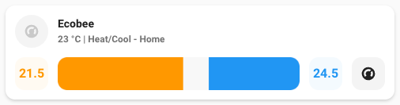
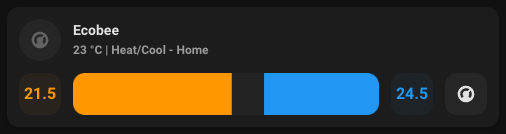

# Thermostat card

## Description

A thermostat card allow you to control a climate entity.

## Configuration variables

All the options are available in the lovelace editor but you can use `yaml` if you want.

| Name                   | Type    | Default     | Description                                                                             |
| :--------------------- | :------ | :---------- | :-------------------------------------------------------------------------------------- |
| `entity`               | string  | Required    | Climate entity                                                                          |
| `icon`                 | string  | Optional    | Custom icon                                                                             |
| `name`                 | string  | Optional    | Custom name                                                                             |
| `layout`               | string  | Optional    | Layout of the card. Vertical, horizontal and default layout are supported               |
| `hide_state`           | boolean | `false`     | Hide the entity state                                                                   |
| `use_action_icon`      | boolean | `false`     | Display the icon for the current action (idle, cooling, etc.) instead of the state icon |
| `use_action_color`     | boolean | `false`     | Display the icon colored for the current action                                         |
| `show_mode_control`    | boolean | `false`     | Display controls for the mode (off, heat, cool, auto)                                   |
| `show_temp_control`    | boolean | `false`     | Display controls for adjusting the target temperature(s)                                |
| `show_temp_indicators` | boolean | `false`     | Display indicators for the temperature controls with the target tempurature(s)          |
| `temperature_gap`      | number  | `1 \| 2`    | Range which limits how close the temperature can be set in dual control modes           |
| `tap_action`           | action  | `toggle`    | Home assistant action to perform on tap                                                 |
| `hold_action`          | action  | `more-info` | Home assistant action to perform on hold                                                |
| `double_tap_action`    | action  | `more-info` | Home assistant action to perform on double_tap                                          |
