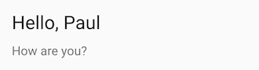

# Title card

## Description

A Title block to separate sections of cards

## Configuration variables

All the options are available in the lovelace editor but you can use `yaml` if you want.

| Name        | Type            | Default  | Description                                                                                                                         |
| :---------- | :-------------- | :------- | :---------------------------------------------------------------------------------------------------------------------------------- |
| `title`     | string          | Optional | Title to render. May contain [templates](https://www.home-assistant.io/docs/configuration/templating/).                             |
| `subtitle`  | string          | Optional | Subtitle to render. May contain [templates](https://www.home-assistant.io/docs/configuration/templating/).                          |
| `entity_id` | `string` `list` | Optional | Only reacts to the state changes of these entities. This can be used if the automatic analysis fails to find all relevant entities. |
