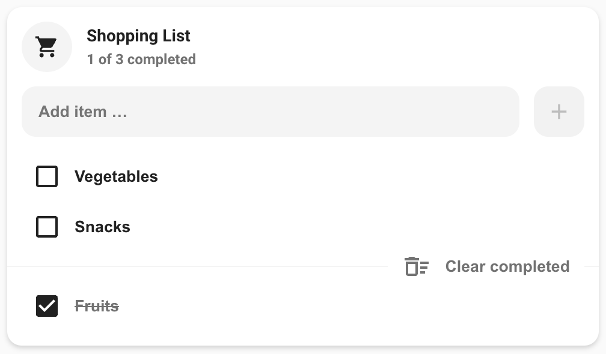

# Todo list card

## Description

A mushroom card for the todo list entity.

## Configuration variables

All options are available in the lovelace editor but you can use `yaml` if you want.

| Name                | Type                              | Default                      | Description                                      |
|:--------------------|:----------------------------------|:-----------------------------|:-------------------------------------------------|
| `entity`            | string                            | Required                     | Todo list entity.                                |
| `name`              | string                            | Todo List                    | Name of the card. May be displayed as its title. |
| `icon`              | string                            | `mdi:format-list-checks`     | Icon displayed next to the title.                |
| `layout`            | `default` `horizontal` `vertical` | `default`                    | Affects the internal layout of the card.         |
| `primary_info`      | `name` `state` `none`             | `name`                       | Info to show as title.                           |
| `secondary_info`    | `name` `state` `none`             | `state`                      | Info to show as subtitle.                        |
| `checked_icon`      | string                            | `mdi:checkbox-marked`        | Icon used for completed items.                   |
| `unchecked_icon`    | string                            | `mdi:checkbox-blank-outline` | Icon used for open items.                        |
| `tap_action`        | action                            | `none`                       | Home assistant action to perform on tap.         |
| `hold_action`       | action                            | `more-info`                  | Home assistant action to perform on hold.        |
| `double_tap_action` | action                            | `none`                       | Home assistant action to perform on double_tap.  |
