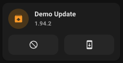

# Update card

## Description

A update card allow you to control a update entity.

## Configuration variables

All the options are available in the lovelace editor but you can use `yaml` if you want.

| Name                   | Type    | Default     | Description                                                                         |
| :--------------------- | :------ | :---------- | :---------------------------------------------------------------------------------- |
| `entity`               | string  | Required    | Update entity                                                                       |
| `name`                 | string  | Optional    | Custom name                                                                         |
| `icon`                 | string  | Optional    | Custom icon                                                                         |
| `use_entity_picture`   | boolean | `false`     | Use the picture of the update entity instead of icon                                |
| `layout`               | string  | Optional    | Layout of the card. Vertical, horizontal and default layout are supported           |
| `fill_container`       | boolean | `false`     | Fill container or not. Useful when card is in a grid, vertical or horizontal layout |
| `show_buttons_control` | boolean | `false`     | Show buttons to install and skip update                                             |
| `collapsible_controls` | boolean | `false`     | Collapse controls when off                                                          |
| `tap_action`           | action  | `more-info` | Home assistant action to perform on tap                                             |
| `hold_action`          | action  | `more-info` | Home assistant action to perform on hold                                            |
| `double_tap_action`    | action  | `more-info` | Home assistant action to perform on double_tap                                      |
